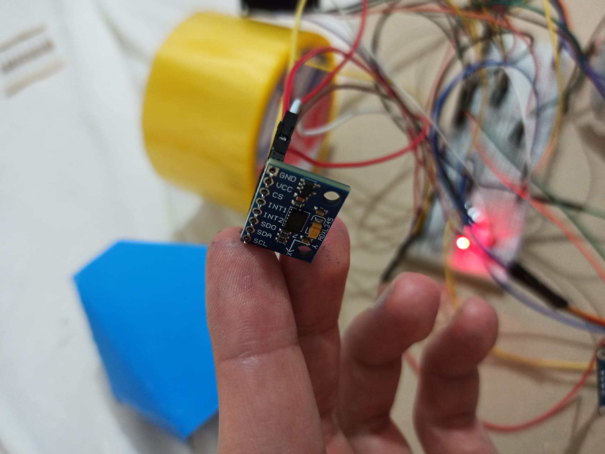
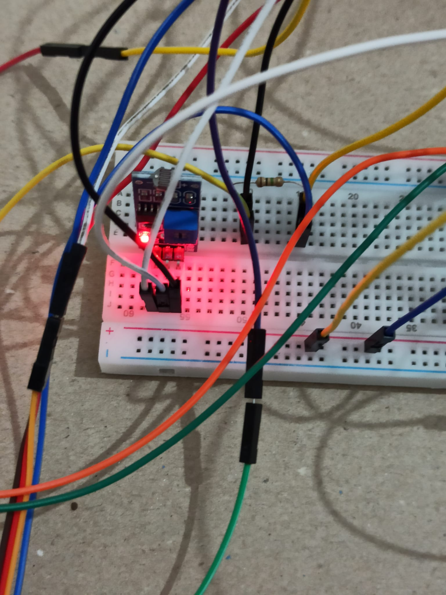
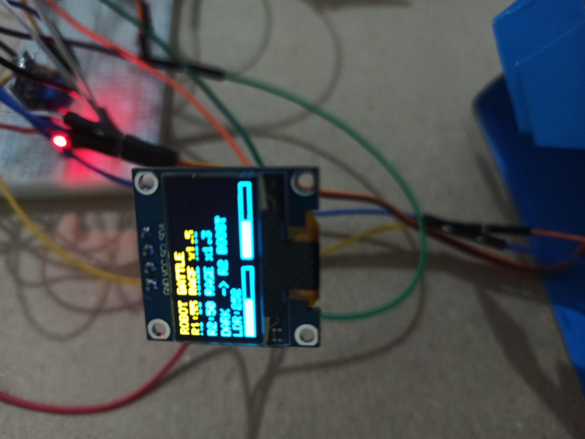
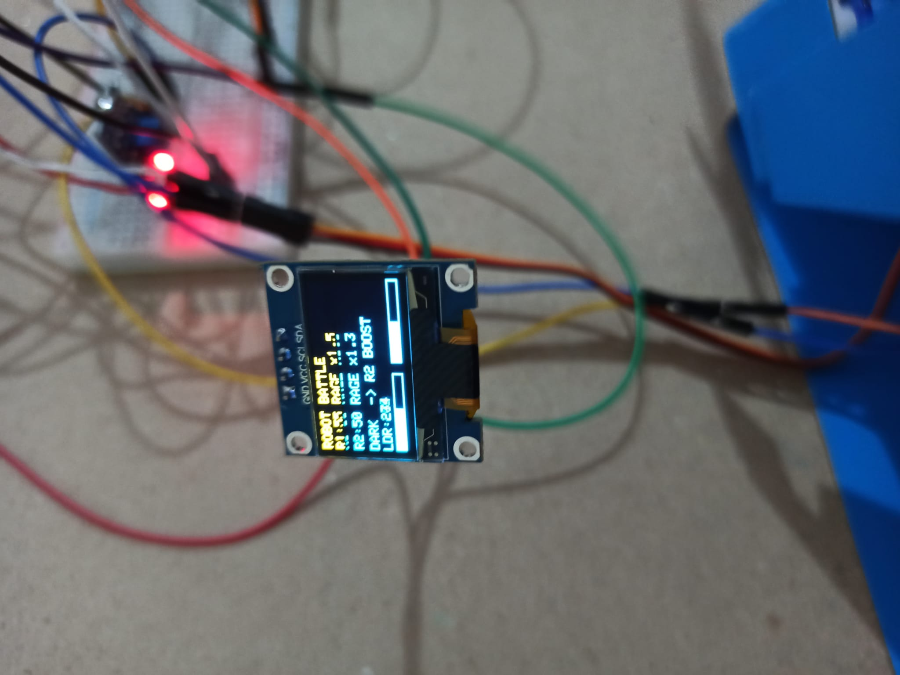
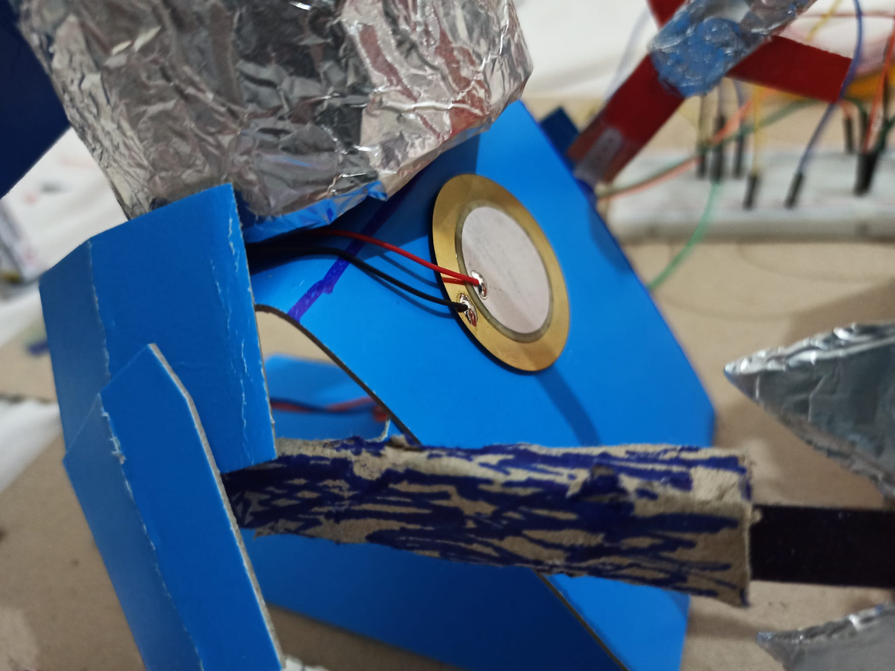
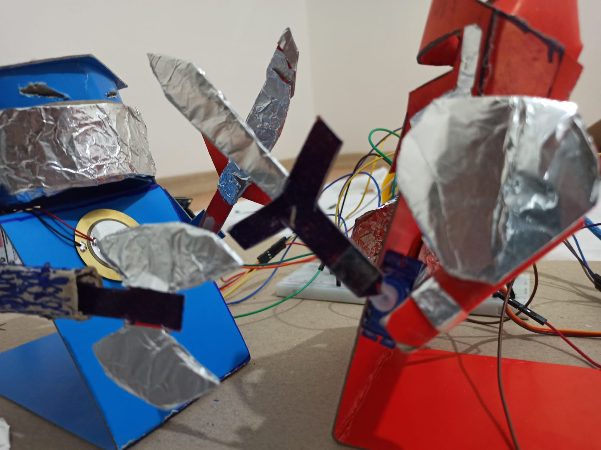
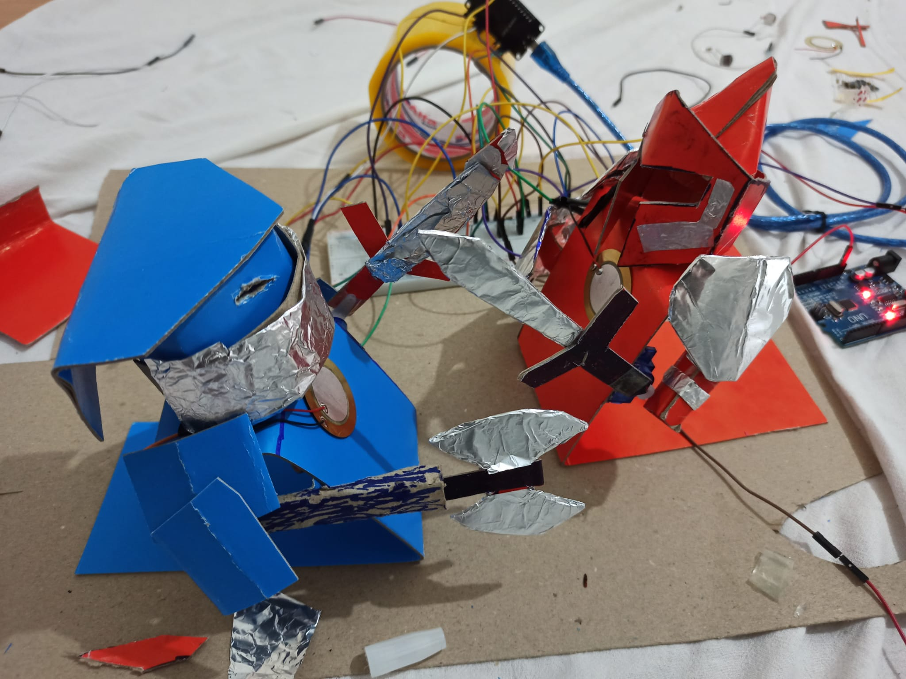
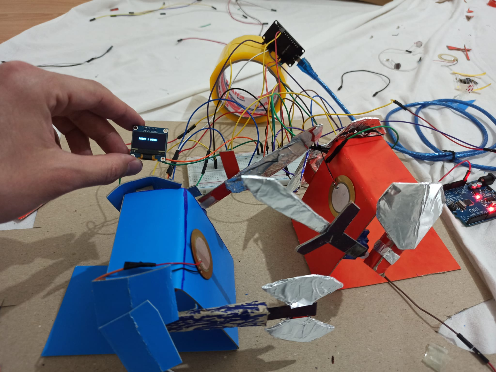
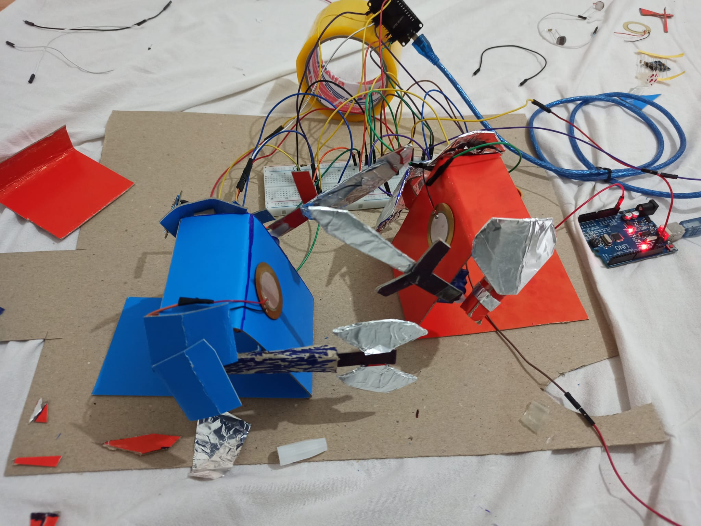
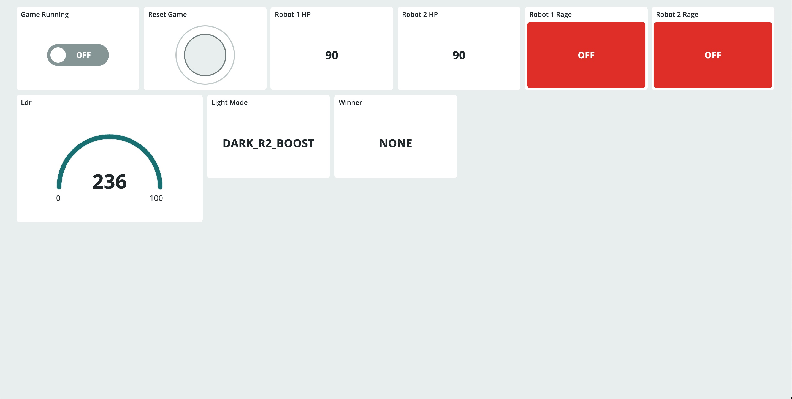

# ChadGPT vs GROKOZILLA: IoT Robot Battle Arena

## 1. Project Summary

ChadGPT vs GROKOZILLA is an IoT-based robot battle project built with ESP32.  
The system includes two cardboard robots that attack each other using servo-driven arms.  
Each robot has a piezo sensor to detect physical hits and reduce health points during the battle.  
An OLED screen displays live health values, rage mode status, light-based speed boosts, and the winner.  
An LDR sensor changes the battle dynamics by giving speed advantage depending on ambient light.  
The project is designed to demonstrate sensor integration, actuator control, real-time feedback, and IoT dashboard monitoring.  
Arduino IoT Cloud is used to start/stop the battle and monitor robot data remotely.

---

## 2. Components List

| Type | Component | Purpose |
|---|---|---|
| Microcontroller | ESP32 DOIT DevKit V1 | Main controller, Wi-Fi, sensor reading, actuator control |
| Sensor 1 | 35mm Piezo Sensor x2 | Detects hits on each robot |
| Sensor 2 | LDR Light Sensor Module | Detects ambient light and changes speed advantage |
| Display | 0.96" OLED SSD1306 I2C Display | Shows HP, rage mode, light mode, and winner |
| Actuator | SG90 Micro Servo x2 | Moves robot arms for attacking |
| Extra | LED | Debug indicator for hit detection |
| Structure | Cardboard / Mukavva | Robot body and arena structure |
| Experimental | ADXL345 Accelerometer | Experimental acceleration measurement |

---

## 3. Wiring Table

| Component | Module Pin / Wire | ESP32 / Power Connection | Description |
|---|---|---|---|
| Piezo Sensor 1 | Signal / Red wire | GPIO34 | Detects hits received by Robot 1 |
| Piezo Sensor 1 | GND / Black wire | GND | Ground connection |
| Piezo Sensor 1 | 1MΩ resistor | Between GPIO34 and GND | Pull-down resistor to reduce false triggers |
| Piezo Sensor 2 | Signal / Red wire | GPIO35 | Detects hits received by Robot 2 |
| Piezo Sensor 2 | GND / Black wire | GND | Ground connection |
| Piezo Sensor 2 | 1MΩ resistor | Between GPIO35 and GND | Pull-down resistor to reduce false triggers |
| LDR Module | AO | GPIO36 / VP | Reads ambient light level |
| LDR Module | VCC | 3V3 | Power for the light sensor module |
| LDR Module | GND | GND | Ground connection |
| OLED SSD1306 | SDA | GPIO21 | I2C data line |
| OLED SSD1306 | SCL | GPIO22 | I2C clock line |
| OLED SSD1306 | VCC | 3V3 | OLED power |
| OLED SSD1306 | GND | GND | OLED ground |
| Servo Motor 1 | Signal / Yellow-Orange wire | GPIO18 | Controls Robot 1 attack arm |
| Servo Motor 1 | VCC / Red wire | Arduino Uno 5V | External 5V power for Servo 1 |
| Servo Motor 1 | GND / Brown-Black wire | Arduino Uno GND + ESP32 GND common | Shared ground for signal reference |
| Servo Motor 2 | Signal / Yellow-Orange wire | GPIO19 | Controls Robot 2 attack arm |
| Servo Motor 2 | VCC / Red wire | External USB 5V cable | Separate 5V power for Servo 2 |
| Servo Motor 2 | GND / Brown-Black wire | USB GND + ESP32 GND common | Shared ground for signal reference |
| Debug LED | Anode (+) | GPIO2 through 220Ω resistor | Turns on when a hit is detected |
| Debug LED | Cathode (-) | GND | LED ground |
| ADXL345 *(experimental)* | SDA | GPIO26 | Experimental acceleration data line |
| ADXL345 *(experimental)* | SCL | GPIO27 | Experimental acceleration clock line |
| ADXL345 *(experimental)* | VCC | 3V3 | Sensor power |
| ADXL345 *(experimental)* | GND | GND | Sensor ground |
| ADXL345 *(experimental)* | CS | 3V3 | Enables I2C mode |
| ADXL345 *(experimental)* | SDO | GND | Sets I2C address to 0x53 |

### Power Distribution Note

The two SG90 servo motors are powered from separate 5V sources instead of powering both from the ESP32.  
Servo Motor 1 is powered from the Arduino Uno 5V pin, while Servo Motor 2 is powered using a cut USB 5V cable.  
This setup was chosen because powering both servos from a single weak 5V source caused unstable movement, slower response, and jitter.  
All grounds are connected together as a common ground so that the ESP32 control signals can be correctly interpreted by the servos.

---

## 4. Wiring Diagram

```text
                         ESP32 DOIT DevKit V1
                    ┌──────────────────────────┐
 Piezo 1 Signal ────┤ GPIO34                   │
 Piezo 2 Signal ────┤ GPIO35                   │
 LDR AO ────────────┤ GPIO36 / VP              │
 OLED SDA ──────────┤ GPIO21                   │
 OLED SCL ──────────┤ GPIO22                   │
 Servo 1 Signal ────┤ GPIO18                   │
 Servo 2 Signal ────┤ GPIO19                   │
 Debug LED ─────────┤ GPIO2                    │
 ADXL SDA ──────────┤ GPIO26                   │
 ADXL SCL ──────────┤ GPIO27                   │
 GND ───────────────┤ GND                      │
                    └──────────────────────────┘

 Servo 1 Power:
 Arduino Uno 5V  ─── Servo 1 VCC
 Arduino Uno GND ─── Servo 1 GND
 Arduino Uno GND ─── ESP32 GND

 Servo 2 Power:
 USB 5V Red Wire ─── Servo 2 VCC
 USB GND Wire ────── Servo 2 GND
 USB GND Wire ────── ESP32 GND

 Piezo Pull-down:
 GPIO34 ── 1MΩ ── GND
 GPIO35 ── 1MΩ ── GND
```

---

## 5. Cloud Setup

The project uses **Arduino IoT Cloud** as the cloud platform.  
The ESP32 is connected to Arduino IoT Cloud over Wi-Fi and controlled through a web dashboard.

### Cloud Platform

| Item | Description |
|---|---|
| Platform | Arduino IoT Cloud |
| Device | ESP32 DOIT DevKit V1 |
| Connection | Wi-Fi |
| Dashboard | Arduino IoT Cloud Dashboard |
| Control Method | Read/Write cloud variables |

### Cloud Variables

| Variable Name | Type | Permission | Purpose |
|---|---|---|---|
| `gameRunning` | Boolean | Read & Write | Starts or stops the robot battle from the dashboard |
| `resetGame` | Boolean | Read & Write | Resets the battle state, HP values, winner, and rage modes |
| `robot1HPCloud` | Integer | Read Only | Displays Robot 1 health points |
| `robot2HPCloud` | Integer | Read Only | Displays Robot 2 health points |
| `robot1RageCloud` | Boolean | Read Only | Shows whether Robot 1 is in rage mode |
| `robot2RageCloud` | Boolean | Read Only | Shows whether Robot 2 is in rage mode |
| `ldrValueCloud` | Integer | Read Only | Displays the current ambient light value |
| `lightModeCloud` | String | Read Only | Shows the active light condition: `LIGHT_R1_BOOST` or `DARK_R2_BOOST` |
| `winnerCloud` | String | Read Only | Displays the current winner or `NONE` during the battle |

### Dashboard Widgets

| Dashboard Widget | Connected Variable | Purpose |
|---|---|---|
| Switch | `gameRunning` | Starts/stops the battle |
| Push Button / Switch | `resetGame` | Resets the battle |
| Value Widget | `robot1HPCloud` | Shows Robot 1 HP |
| Value Widget | `robot2HPCloud` | Shows Robot 2 HP |
| LED / Status Widget | `robot1RageCloud` | Indicates Robot 1 rage mode |
| LED / Status Widget | `robot2RageCloud` | Indicates Robot 2 rage mode |
| Gauge / Value Widget | `ldrValueCloud` | Shows ambient light level |
| Text Widget | `lightModeCloud` | Shows which robot receives the light-based speed boost |
| Text Widget | `winnerCloud` | Shows the battle winner |

---

## 6. How to Run

### Required Libraries

Install the following libraries in Arduino IDE or Arduino Cloud Editor:

| Library | Purpose |
|---|---|
| `ESP32Servo` | Controls the two SG90 servo motors |
| `Wire` | Enables I2C communication |
| `Adafruit GFX Library` | Graphics library for the OLED display |
| `Adafruit SSD1306` | Controls the OLED display |
| `ArduinoIoTCloud` | Connects ESP32 to Arduino IoT Cloud |
| `Arduino_ConnectionHandler` | Handles Wi-Fi connection for Arduino IoT Cloud |

### Board Settings

Use the following board configuration:

| Setting | Value |
|---|---|
| Board | DOIT ESP32 DEVKIT V1 |
| Microcontroller | ESP32 |
| Upload Speed | 921600 or 115200 |
| Serial Monitor Baud Rate | 9600 or 115200 depending on the uploaded code |
| Wi-Fi | 2.4 GHz mobile hotspot or router |

### Wi-Fi / Cloud Configuration

The ESP32 connects to Wi-Fi using the credentials defined in `thingProperties.h`.

Example:

```cpp
const char SSID[] = "YOUR_WIFI_NAME";
const char PASS[] = "YOUR_WIFI_PASSWORD";
const char DEVICE_KEY[] = "YOUR_DEVICE_SECRET_KEY";
```

For security, real Wi-Fi passwords and Arduino Cloud Device Secret Keys should not be committed to GitHub.  
In the public repository, these values should be replaced with placeholders.

### Upload Steps

1. Create a Thing in Arduino IoT Cloud.
2. Add the required cloud variables.
3. Open the generated sketch.
4. Paste the main ESP32 code into the `.ino` file.
5. Keep or update the generated `thingProperties.h` file.
6. Select the board as **DOIT ESP32 DEVKIT V1**.
7. Select the correct serial port.
8. Upload the sketch to the ESP32.
9. Open the Arduino IoT Cloud Dashboard.
10. Turn on the `gameRunning` switch to start the battle.

---

## 7. How It Works

The system is controlled by an ESP32 microcontroller.  
Two cardboard robots attack each other using SG90 servo motors.  
Each robot has a piezo sensor attached to its body to detect physical hits.

When a piezo sensor detects a hit, the ESP32 reduces the corresponding robot's HP by 5 points.  
The OLED display is updated immediately to show the new HP values, rage mode status, light mode, and winner information.

The LDR sensor measures ambient light.  
If the environment is bright, Robot 1 receives an additional speed multiplier.  
If the environment is dark, Robot 2 receives the speed multiplier.  
This creates a dynamic battle mechanic based on real-world lighting.

When a robot's HP drops below 75, it enters rage mode.  
In rage mode, a random speed multiplier is assigned to that robot, making the battle less predictable.

The ESP32 uploads important battle data to Arduino IoT Cloud:

- Robot 1 HP
- Robot 2 HP
- Robot 1 rage mode status
- Robot 2 rage mode status
- LDR light value
- Active light mode
- Winner status

The Arduino IoT Cloud Dashboard also controls the battle:

| Dashboard Control | Logic |
|---|---|
| `gameRunning = ON` | Servos start moving and the battle begins |
| `gameRunning = OFF` | Servos stop and the battle pauses |
| `resetGame = ON` | HP values return to 100 and battle state resets |

The ESP32 continuously calls `ArduinoCloud.update()` inside the main loop.  
This keeps the device synchronized with the dashboard and allows real-time control from the cloud.

---

## 8. Evidence

### Project Screenshots





















### Demo Video

[Watch the demo video](https://youtube.com/shorts/k6hjZ_66bD4?feature=share)

---

## 9. Notes and Limitations

- The servo motors require stable external 5V power. Powering both servos from a single weak 5V source caused unstable movement, slower response, and jitter.
- For this reason, the two servos are powered from separate 5V sources: one from the Arduino Uno 5V pin and the other from an external USB 5V cable.
- All grounds are connected together to ensure that the ESP32 servo control signals are correctly interpreted.
- Piezo sensors are sensitive to cable movement and mechanical vibration, so their wires must be fixed to the cardboard body to reduce false hit detection.
- The ADXL345 accelerometer was added experimentally, but the main working sensors for the final battle logic are the piezo sensors and the LDR module.
- The robot bodies are made from cardboard, so mechanical stability affects hit detection and servo performance.
- The robot heads will be attached on the presentation day. This is because after gluing the heads permanently, fixing or disassembling the internal components in case of a possible problem would become almost impossible.